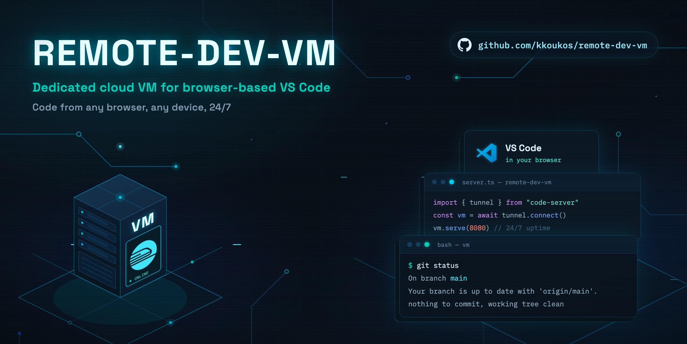

# Claude Dev VM

> **tl;dr:** a lil server that codes for you fr. yeet it a feature idea from your phone
> at 2am, it locks in, ships the code, and drops a PR — no cap. it never merges on its
> own tho, that's on you bestie. 💅

A 24/7 cloud VM that runs coding agents for you: send it a goal or a full plan — from
VS Code, from Claude Cowork, from your phone, from any agent — and it implements the
feature and opens a GitHub PR. Never merges. Agents are pluggable (Claude Code today,
Codex/OpenCode/whatever tomorrow). Can also go from nothing — `create:true` makes a
brand-new GitHub repo and builds a working v1 into it (see [0→1](#0-1-new-products)).
Bigger asks can be broken into a tree of subplans and dispatched together —
independent ones run in parallel, dependent ones stack — see
[`/plan`](#plan-subplan-trees).

## Architecture

```
 you / Cowork / any agent
   │
   ├─ HTTP API ────────────► agent-runner (port 7777) ──► runners/claude.sh ─► /goal ─► PR
   ├─ GitHub issue ───────►  issue-poller (1-min timer) ──┘        codex.sh
   ├─ VS Code Remote Tunnel ► local VS Code attach + Live Share    opencode.sh
   ├─ code-server ─────────► VS Code in any browser
   └─ ssh / run-goal.sh ───► manual & detached runs
```

```
provision.sh            fresh Ubuntu 24.04 → dev box (node, gh, code-server, Claude Code)
setup-agent-runner.sh   control plane: HTTP API + issue queue + token store (systemd)
setup-self-update.sh    self-updater: separate systemd timer that git-pulls + redeploys
setup-tunnel.sh         VS Code Remote Tunnel → local VS Code attach + Live Share
run-goal.sh             manual detached run via tmux
vm-cli.mjs              LOCAL cli (runs on your laptop) — configure + mint tokens over ssh
skills/goal/SKILL.md    the /goal skill — existing repo, feature → PR
skills/bootstrap/SKILL.md  the /bootstrap skill — empty repo → working v1
skills/plan/SKILL.md    the /plan skill — idea → subplan tree, dispatched to the VM
agent-runner/           job server, runners, issue poller
agent-runner/self-update.sh  pull-based self-updater (git pull + redeploy + restart)
agent-runner/tokens-cli.mjs  mint/list/revoke per-caller API tokens (run on the VM)
agent-runner/set-env.mjs     safely rewrite known .env keys (called remotely by vm-cli.mjs)
agent-runner/runners/claude-settings.json  guardrails for unattended claude runs (see Safety & cost)
agent-runner/runners/guard-hook.sh         PreToolUse hook backing those guardrails
```

## Setup (once)

> No VPS? The control plane also runs on Railway — see [DEPLOY_RAILWAY.md](DEPLOY_RAILWAY.md).
> Want the full setup (VS Code tunnel included) on Azure instead of a generic
> VPS provider? See [AZURE.md](AZURE.md).

```bash
# 1. On a fresh Ubuntu 24.04 VPS, as root:
DOMAIN=code.example.com bash provision.sh        # DOMAIN optional

# 2. As dev — authenticate:
claude                    # or: claude setup-token → export CLAUDE_CODE_OAUTH_TOKEN=...
gh auth login && gh auth setup-git
git config --global user.name "Kostas" && git config --global user.email kostas@domicode.gr

# 3. Install /goal, /bootstrap, and /plan globally:
mkdir -p ~/.claude/skills/goal ~/.claude/skills/bootstrap ~/.claude/skills/plan
cp skills/goal/SKILL.md ~/.claude/skills/goal/
cp skills/bootstrap/SKILL.md ~/.claude/skills/bootstrap/
cp skills/plan/SKILL.md ~/.claude/skills/plan/

# 4. Control plane + tunnel:
bash setup-agent-runner.sh      # prints an admin token (see Auth & tokens below)
bash setup-tunnel.sh            # GitHub device-flow login
```

### From your laptop — vm-cli.mjs

`setup-agent-runner.sh` leaves `REPOS_DIR` / `REPOS` / `RUNNER` in `~/agent-runner/.env`
with their defaults, and minting more tokens means SSHing in each time. `vm-cli.mjs`
runs locally on your own machine and does both over plain ssh — same access you already
used to provision the box, no new open port:

```bash
./vm-cli.mjs connect dev@vps.example.com --name prod   # save + select the host
./vm-cli.mjs configure                                 # prompts for REPOS_DIR / REPOS / RUNNER, restarts the service
./vm-cli.mjs tokens add --name cowork --repos my-app,other-app
./vm-cli.mjs status                                     # current config + service health
```

It only ever touches the allowlisted config keys (`REPOS_DIR`, `REPOS`, `RUNNER`, `PORT`,
`MAX_CONCURRENT_PER_TOKEN`) via `agent-runner/set-env.mjs` on the remote end — it can't
read or overwrite `AGENT_RUNNER_TOKEN` or anything else in `.env`. `connect --name` lets
you juggle multiple boxes; `use <name>` switches the default, or pass `--host <name>` per
command.

## Controlling it

### From VS Code

- **Local VS Code**: Remote Explorer → Tunnels → `claude-vm`. Full marketplace, and
  **Live Share works from here** — start a session in the attached window; it's hosted
  on the VM and outlives your laptop.
- **Browser**: code-server at your domain (or `ssh -L 8080:127.0.0.1:8080 dev@vps` →
  localhost:8080), or `vscode.dev/tunnel/claude-vm`.
- In either, open a terminal: `claude` → `/goal ...`, or `./run-goal.sh <repo> "<goal>"`
  for a detached run.

### Auth & tokens

There is no single shared secret. `setup-agent-runner.sh` mints one **admin** token
(scoped to all repos, `*`) and prints it once. From there, mint a separate named token
per caller — Cowork, your phone, CI, a teammate — each independently revocable and
scoped to only the repos it needs:

```bash
node ~/agent-runner/tokens-cli.mjs add --name cowork --repos "my-app,other-app"
node ~/agent-runner/tokens-cli.mjs add --name phone --repos "*" --expires-days 90
node ~/agent-runner/tokens-cli.mjs list
node ~/agent-runner/tokens-cli.mjs revoke --name cowork
```

Run those from your laptop instead via `./vm-cli.mjs tokens add|list|revoke ...` (see
[vm-cli.mjs](#from-your-laptop--vm-climjs)) — same commands, no SSH session to keep open.

Only a hash of each token is stored (`~/agent-runner-data/tokens.json`) — the plaintext
is shown once at mint time and can't be recovered, only replaced. A token can only see,
start, or cancel jobs against repos in its own scope; every job start/cancel and every
rejected request is appended to `~/agent-runner-data/audit.log`.

### From Claude Cowork or any agent — HTTP API

```bash
curl -H "Authorization: Bearer $TOKEN" -X POST https://code.example.com/agent/jobs \
  -d '{"repo":"my-app","goal":"<one-liner OR full multi-line plan markdown>","runner":"claude"}'

curl -H "Authorization: Bearer $TOKEN" https://code.example.com/agent/jobs          # list (scoped to this token)
curl -H "Authorization: Bearer $TOKEN" https://code.example.com/agent/jobs/<id>     # status + prUrl + log tail
curl -H "Authorization: Bearer $TOKEN" -X POST .../jobs/<id>/cancel
```

`repo` is a **bare name** (no slashes, no `~`), always resolved under `REPOS_DIR`
(`~/repos` by default, set in `.env`) — a job can never target a path outside it.
`goal` accepts a full plan — so in Cowork just say: _"POST this plan to my VM at
https://code.example.com/agent/jobs with token X, repo my-app"_. Add `gitUrl` to
auto-clone if the repo isn't on the VM yet, or `"create":true` to make a brand-new
GitHub repo instead (see 0→1 below). Add `"model"` / `"effort"` to control strength —
see [Choosing model & effort](#choosing-model--effort).

Only one **non-worktree** job per repo runs at a time (a second plain request against
a busy repo is rejected, so two agents never race on the same shared git working
tree) — pass `"branch"` to opt a job into its own isolated worktree instead (see
[`/plan`](#plan-subplan-trees) below), and those run concurrently with each other and
with the primary job. Each token is capped at `MAX_CONCURRENT_PER_TOKEN` (default 5)
concurrent jobs regardless.

The API listens on 127.0.0.1 only. To expose it, add to `/etc/caddy/Caddyfile`
(inside your site block) and `systemctl reload caddy`:

```
handle_path /agent/* {
    reverse_proxy 127.0.0.1:7777
}
```

No domain? Use an SSH tunnel: `ssh -L 7777:127.0.0.1:7777 dev@vps`.

### From anywhere — GitHub issue queue

Set `REPOS="you/repo1 you/repo2"` in `~/agent-runner/.env` on the VM. Then from any
device or agent with GitHub access:

```bash
gh issue create -R you/repo1 --label agent-goal \
  --title "Add password reset" --body "<optional detailed plan>"
```

Within a minute the VM picks it up, comments "started", runs the job, and comments
back the PR link. Free audit trail on the issue. The poller uses its own dedicated
`issue-poller` token (minted at setup, stored in `.env`) — revoke/rotate it
independently of any other caller's token.

## 0→1: new products

Point a job at a repo name that doesn't exist yet and pass `"create":true` — the
server runs `gh repo create` (private by default) instead of cloning, then hands the
job to `/bootstrap` instead of `/goal`, which scaffolds a real stack, implements a
working v1, and pushes straight to `main` (there's nothing to protect yet — no PR for
the very first commit). Every job after that on the same repo goes through the normal
`/goal` flow: branch, implement, PR.

```bash
curl -H "Authorization: Bearer $TOKEN" -X POST https://code.example.com/agent/jobs \
  -d '{"repo":"new-app","create":true,"goal":"a Next.js waitlist landing page with email capture"}'
```

Optional fields: `"visibility"` (`private` default, or `public`/`internal`), `"owner"`
(create under a GitHub org instead of your personal account). `create` and `gitUrl`
are mutually exclusive — use `create` for a product that doesn't exist anywhere yet,
`gitUrl` to bring an existing repo onto the VM.

## /plan: subplan trees

For anything bigger than one `/goal`, `/plan` (interactive, run wherever you're
already talking to Claude — laptop, VS Code, Cowork, phone) turns a feature idea into
a small **tree** of subplans and registers the whole tree with `agent-runner` in one
call:

```bash
curl -H "Authorization: Bearer $TOKEN" -X POST https://code.example.com/agent/plans \
  -d '{"repo":"my-app","subplans":[
        {"slug":"api",      "goal":"add a /settings API endpoint"},
        {"slug":"ui",       "goal":"add a settings page that calls it", "dependsOn":"api"}
      ]}'

curl -H "Authorization: Bearer $TOKEN" https://code.example.com/agent/plans/<planId>
```

Each subplan may `dependsOn` **at most one** other slug — subplans form a tree, not a
general dependency graph, because a stacked git branch only has one base. A root
subplan (no `dependsOn`) branches off the repo's default branch; a subplan that
`dependsOn` another gets its worktree branched off the **parent's branch** once the
parent's job finishes, and opens its PR with `--base <parent-branch>` (a stacked PR)
— so review/merge order should follow the tree: parents before children.

Under the hood, each subplan is a normal job with `"branch":"feat/<slug>"` — its own
git worktree at `REPOS_DIR/.worktrees/<repo>/feat/<slug>`, so independent subplans run
concurrently instead of queueing behind `repoBusy`. `agent-runner` itself keeps
dispatching dependents on a timer as their parents' jobs finish — **the caller does
not need to stay connected**; register the plan, walk away, and check back later with
`GET /plans/<planId>`. Nothing auto-merges, same as `/goal`.

For a brand-new product (repo doesn't exist on the VM yet), exactly one subplan sets
`"create":true` or `"gitUrl"`; every other subplan is automatically made to depend on
it, so nothing branches off a repo that doesn't have a first commit yet.

`GET /repos/<repo>/context` (used internally by `/plan`'s exploration step, but
callable directly) returns `CLAUDE.md`/`README.md`/manifest contents and a
tracked-file listing for a repo already on the VM, or `{"exists":false}` — this is how
`/plan` gathers context without needing a local clone of the repo it's planning
against.

## Choosing model & effort

Pass `"model"` (`opus`/`sonnet`/`haiku`, or a full ID like `claude-opus-4-8`) and
`"effort"` (`low`/`medium`/`high`/`xhigh`/`max`, availability depends on the model) in
the job body — `claude.sh` forwards them straight to `claude -p` as `--model`/`--effort`.
Match strength to the task: a one-line fix is fine on `sonnet`/`low`; an architecture
change or a `/bootstrap` job benefits from `opus`/`high`. Omit either to use your
account's configured default.

## Swapping agents

Runners are shell scripts in `~/agent-runner/runners/`. `claude.sh` is the default;
`codex.sh` and `opencode.sh` are ready templates (their `--model` flag is an unverified
convention — check `--help` on your installed version). Add `mytool.sh` (args:
repo-dir, prompt-file; reads `$FRESH`/`$MODEL`/`$EFFORT` from the environment) and pass
`"runner":"mytool"` per job — or set `RUNNER=` in `.env` for the issue queue.
Non-Claude runners embed the PR/bootstrap instructions in the prompt since they can't
use the `/goal` or `/bootstrap` skills.

## Self-updating

The box updates itself from this very repo. `setup-agent-runner.sh` installs a
**separate** systemd timer — `agent-selfupdate.timer` — that every ~2 min runs
`agent-runner/self-update.sh`: it `git fetch`es the source checkout, and if
`origin/main` is a fast-forward ahead, pulls it, redeploys the code into
`~/agent-runner` (preserving `.env`), restarts `agent-runner.service`, and
health-checks it. So the normal loop is: point the VM at its own repo with
`/goal`, review the PR, **merge it**, and within a couple minutes the box is
running the new code — it maintains itself.

The updater is deliberately **not** part of the server, and that separation is
the entire point. The main server has `Restart=always`; if a bad commit crashes
it, it just crash-loops — and a webhook or update endpoint *inside* the server
would be down right along with it, unable to pull the fix. The self-updater is
an independent oneshot on its own timer, so it keeps polling regardless of the
server's health: push a fix, the next tick pulls and redeploys it, and the box
self-heals. For that reason it only ever moves **forward** (fast-forward only,
never a rollback or history rewrite) — rolling back would just re-pull and
re-crash on the same commit next tick.

```bash
# Installed automatically by setup-agent-runner.sh. To (re)install or retune:
SELF_UPDATE_INTERVAL=300 SELF_UPDATE_BRANCH=main bash setup-self-update.sh
SELF_UPDATE=0 bash setup-agent-runner.sh          # opt out at setup time

systemctl start agent-selfupdate.service          # force a check right now
systemctl list-timers agent-selfupdate.timer      # when it next fires
journalctl -u agent-selfupdate.service -f         # or: tail -f ~/agent-runner-data/self-update.log
```

Scope: the updater redeploys **code** (server, runners, poller, and the updater
script itself — the next tick runs the new version). Changes to the systemd
*unit files* are infra, not code, so after a commit that edits
`setup-agent-runner.sh` / `setup-self-update.sh` unit definitions, re-run the
relevant setup script once by hand. It refuses to run on a dirty working tree or
a diverged branch, so local edits on the box are never clobbered.

## Safety & cost

- Jobs run with `--permission-mode dontAsk` — fine on a dedicated VM, don't do it
  on your laptop. This is a much bigger deal than it sounds: `provision.sh` gives the
  dev user **passwordless sudo**, so a job (or a malicious/mistaken goal) has the same
  reach as anything you could type over SSH, not just the repo it's pointed at. Token
  scoping controls *who can submit a job and against which repo*; it does not sandbox
  *what a running job can do*. For real containment, run jobs under a separate
  non-sudo system user, or use Anthropic's reference devcontainer (default-deny
  firewall): code.claude.com/docs/en/devcontainer.
- **Runner guardrails** (`agent-runner/runners/claude-settings.json` +
  `guard-hook.sh`, loaded by `claude.sh` and `run-goal.sh` via `--settings`) block
  the highest-blast-radius actions regardless of goal wording: recursive
  force-delete (`rm -rf` and reordered/long-flag variants), destructive git history
  rewrites (`reset --hard`, `push --force`, `branch -D`, `clean -f`), flipping an
  *existing* repo's visibility or deleting it (`gh repo edit --visibility public`,
  `gh repo delete` — `gh repo create --public` for a brand-new 0→1 repo is
  intentionally still allowed), and reading `.env*`/Doppler/SSH/AWS secrets or
  dumping the process environment. Installing new interpreters/tools (python,
  node versions, global libraries, etc.) is deliberately **allowed**, including
  via `apt`/`yum`/`dnf`/`snap`/`dpkg`/`npm`/`pip` install commands run under
  `sudo` — `sudo` is scoped to those install invocations specifically, so it
  still can't be used for `rm`, `cat`, `bash`, `su`, or anything else outside
  that allowlist. This is regex-based defense-in-depth on top of
  `permissions.deny` (which is enforced regardless of permission mode), not a
  sandbox — a sufficiently adversarial prompt could still find phrasing that
  slips past it, and a scoped-but-real `sudo` plus arbitrary package installs is
  itself meaningful attack surface if a goal is ever adversarial (e.g. a
  malicious GitHub issue on a repo with outside collaborators). For untrusted
  input, use the devcontainer above instead.
- Nothing merges: protect `main` with branch protection; the `/goal` skill and runner
  prompts forbid merging. `/bootstrap` pushes directly to `main` only for a repo's
  literal first commit (nothing to protect yet), then defers to `/goal`.
- Tokens are scoped and individually revocable (see Auth & tokens) — mint one per
  caller instead of sharing. `audit.log` records who started/cancelled what.
- Headless `claude -p` bills against the separate Agent SDK credit pool (Pro/Max,
  since June 2026).
